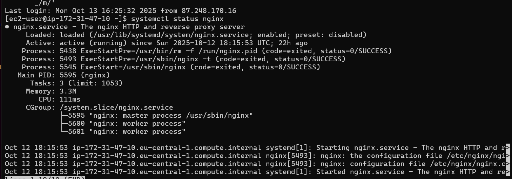

# Лабораторная работа №2. Введение в AWS Вычислительные сервисы

## Цель работы
Познакомиться с основными вычислительными сервисами AWS, научиться создавать и настраивать виртуальные машины (EC2), а также развёртывать простые веб-приложения.

### Задание 3. Создание и запуск EC2 экземпляра (виртуальной машины)

В этом задании мы создали и запустили виртуальную машину в Amazon EC2 с именем webserver на основе Amazon Linux 2023 AMI. Настроили ключ для SSH-доступа и группу безопасности, разрешив HTTP и SSH-трафик. В разделе User Data добавили скрипт, который автоматически обновляет систему, устанавливает и запускает nginx. После запуска проверили работу веб-сервера по публичному IP-адресу. веб-сервер работает, открыв в браузере URL: http://<Public-IP>, где <Public-IP>

### Задание 4. Логирование и мониторинг

Вкладка Status checks.

Monitoring
я проверила состояние моего инстанса EC2 с помощью вкладок Status checks и Monitoring. Убедилась, что система работает без ошибок (2/2 checks passed), и посмотрела метрики в CloudWatch. Также открыла System Log и Instance Screenshot, чтобы увидеть процесс запуска и убедиться, что сервер загружается корректно.

### Задание 5. Подключение к EC2 инстансу по SSH

я подключилась к своему экземпляру EC2 по протоколу SSH. Для этого я использовала приватный ключ .pem, который был создан при запуске виртуальной машины. Сначала я установила правильные права доступа к ключу, чтобы обеспечить безопасность подключения, а затем выполнила команду ssh, указав имя пользователя ec2-user и публичный IP-адрес сервера. После успешного подключения я проверила, что веб-сервер Nginx запущен и работает корректно с помощью команды systemctl status nginx.

### 6a

### Контрольные вопросы
1) Что делает политика AdministratorAccess?
Политика AdministratorAccess даёт пользователю или группе полный доступ ко всем сервисам AWS. То есть пользователь с этой политикой может создавать, изменять и удалять любые ресурсы в аккаунте как администратор.

2) В каких случаях важно включать детализированный мониторинг (Detailed monitoring)?
Детализированный мониторинг стоит включать, когда нужно получать метрики работы сервера с большей точностью — например, если важно отслеживать нагрузку и производительность в реальном времени.

3) Что такое User Data и какую роль выполняет данный скрипт?
Это скрипт, который выполняется автоматически при первом запуске виртуальной машины. Он позволяет сразу установить нужные пакеты, настроить сервисы и автоматизировать стартовые действия без ручного входа в систему.

4) Для чего используется nginx?
nginx используется как веб-сервер, он принимает HTTP-запросы от пользователей и отдаёт веб-страницы. Его часто применяют для размещения сайтов и балансировки нагрузки.

5) Почему в AWS нельзя использовать пароль для входа по SSH?
Парольный вход менее безопасен, потому что его можно подобрать или перехватить. AWS использует вход по SSH-ключам, где аутентификация выполняется через пару «публичный и приватный ключ». Это безопаснее, потому что приватный ключ хранится только у пользователя и не передаётся по сети.

6) Что делает команда scp?
scp (secure copy) используется для копирования файлов между локальным компьютером и удалённым сервером по защищённому SSH-соединению.

7) Чем Stop отличается от Terminate?
Команда Stop просто останавливает виртуальную машину, но оставляет её настройки и диск, чтобы потом можно было запустить снова.
А Terminate полностью удаляет инстанс вместе с данными после этого восстановить его нельзя.

8) Что делает данный конфигурационный файл Nginx?
Этот конфигурационный файл задаёт настройки для веб-сайта:
- Указывает, что сервер слушает порт 80 (HTTP).
- Определяет корневую директорию сайта (/usr/share/nginx/html) и главные файлы (index.php, index.html).
- В блоке location / задаёт правило для обработки обычных запросов и возврата ошибки 404, если файл не найден.
- В блоке location ~ \.php$ описывает обработку PHP-файлов через PHP-FPM (использует Unix-сокет /run/php-fpm/www.sock).
- Блок location ~ /\.ht запрещает доступ к скрытым файлам .ht*.